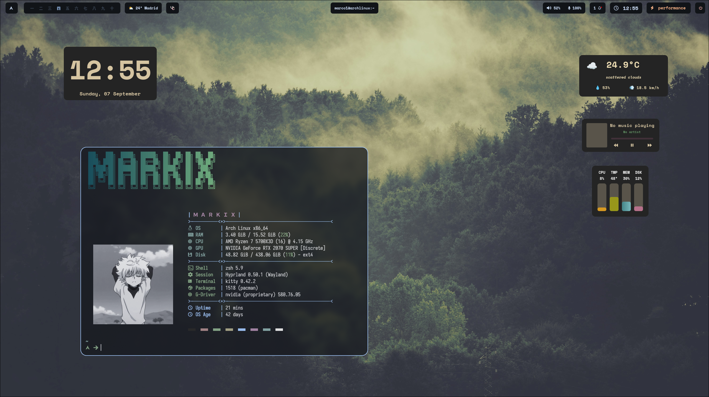
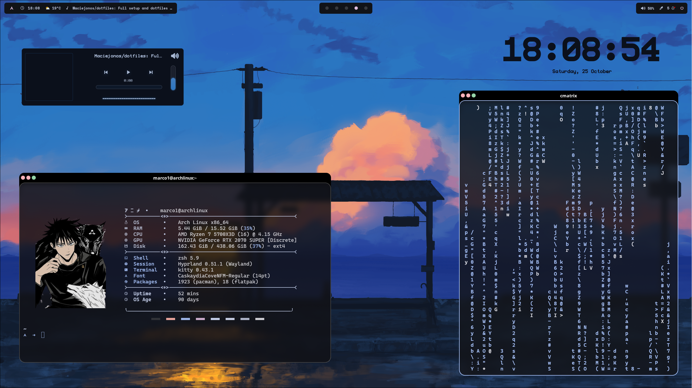

## My Hyprland Rice

My personal, simple and functional dotfiles for Hyprland window manager.

Most of the modules are powered by [Matugen](https://github.com/InioX/matugen)

- **Terminal:** [Kitty](https://github.com/kovidgoyal/kitty)
- **Shell:** [Zsh](https://github.com/ohmyzsh/ohmyzsh/wiki/Installing-ZSH)
- **Bar:** [Waybar](https://github.com/Alexays/Waybar)
- **App launcher:** [Rofi](https://github.com/davatorium/rofi)

## Preview

